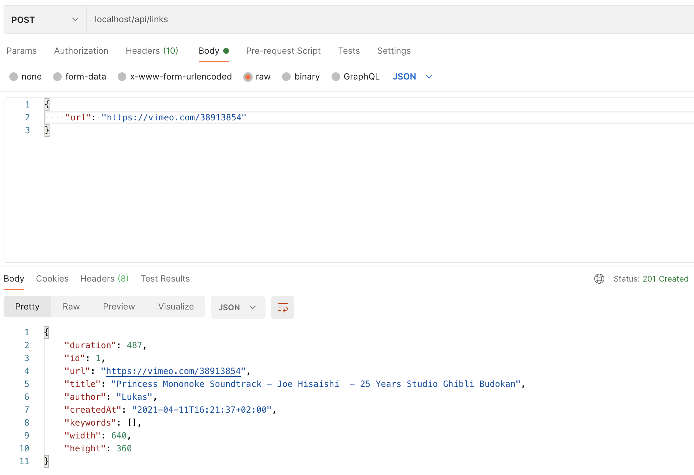
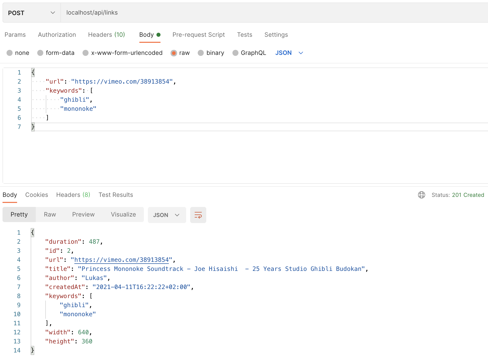
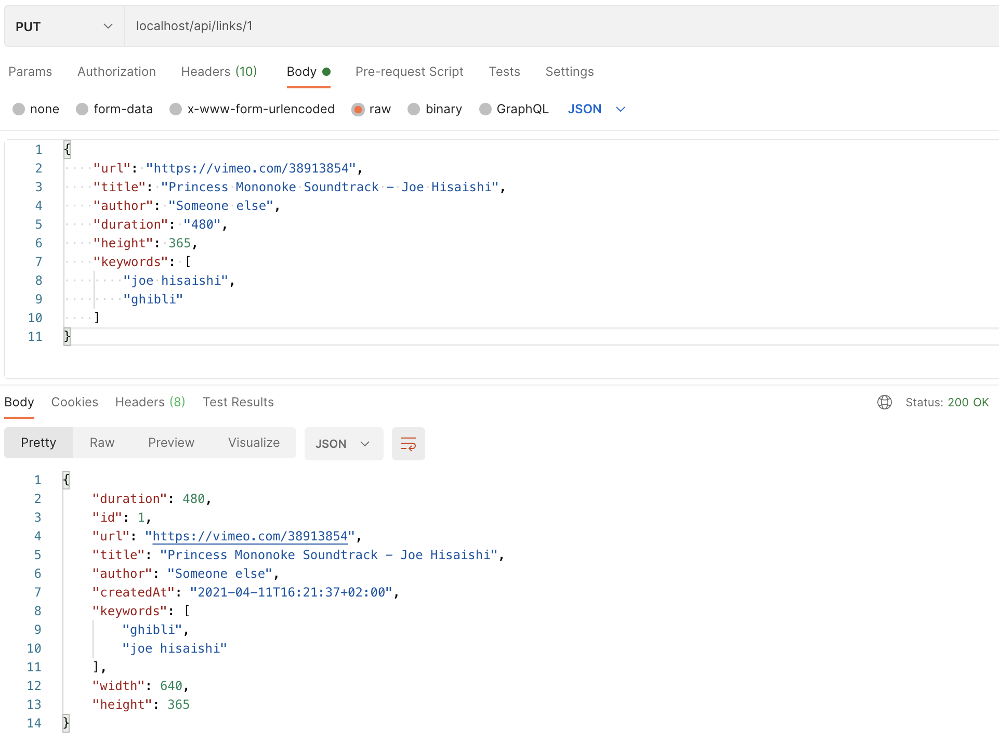
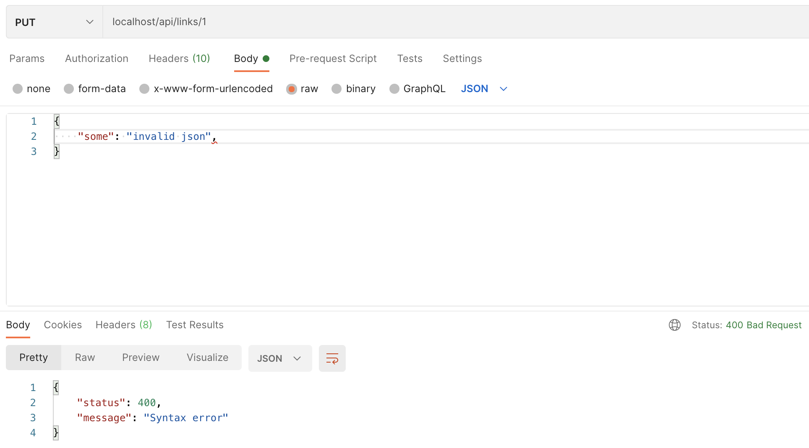
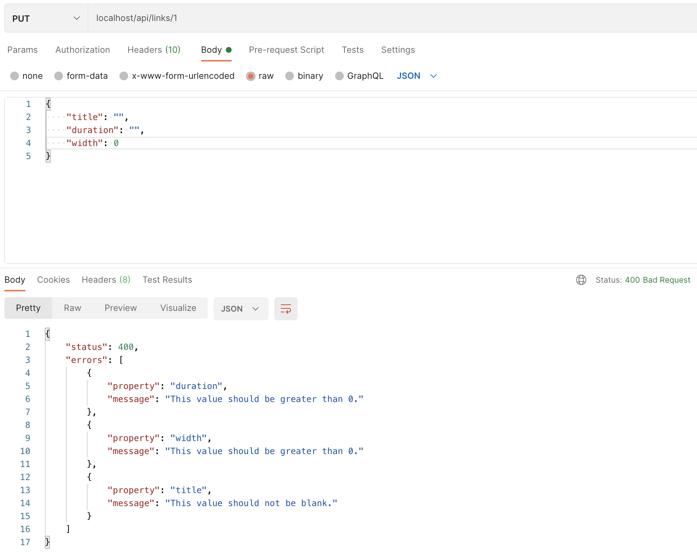
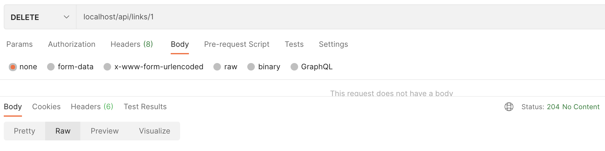
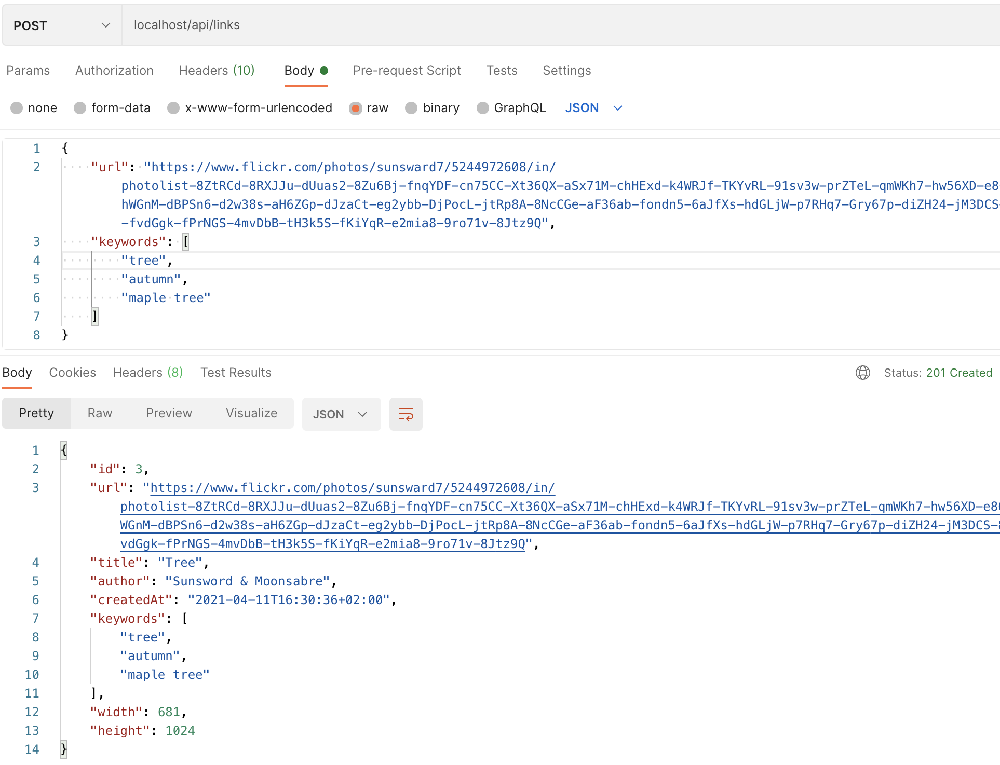
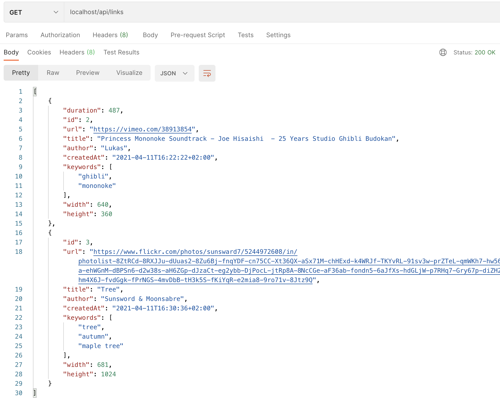

Versions utilisées:
==================

PHP Version: 7.4 ([La SEULE version 7.x encore maintenue](https://www.php.net/supported-versions))

Symfony Version: 4.4 (LTS)

Installation:
=============

`make install` suffit à :
- builder les images
- lancer les containeurs
- faire un composer install
- lancer les migrations doctrine

Raccourcis:
===========

- `make up` permet de lancer le projet
- `make down` stop et détruit les containers
- `make php` permet de rentrer dans le container php

Exemples d'utilisation:
=======================

*Création d'un lien (sans mots-clés):*

*Création d'un lien (avec mots-clés):*

*Modification d'un lien (propriétés et mots-clés):*

*Message d'erreur si JSON mal formatté:*

*Message d'erreur si la validation ne passe pas:*

*Suppression d'un lien:*

*Création d'un lien (flickr):*

*Récupération de la liste:*

